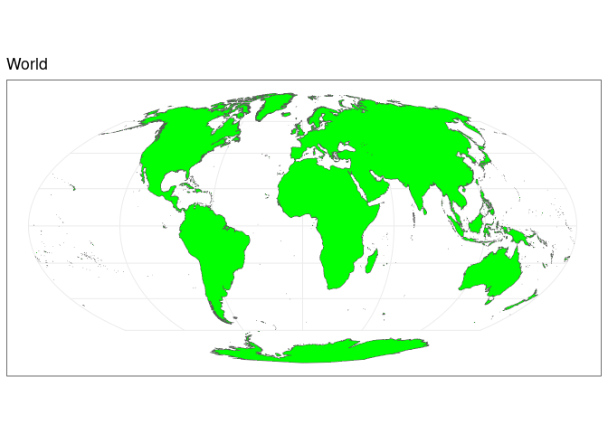
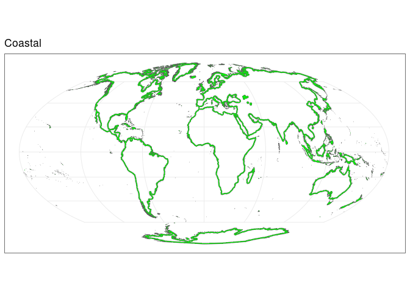
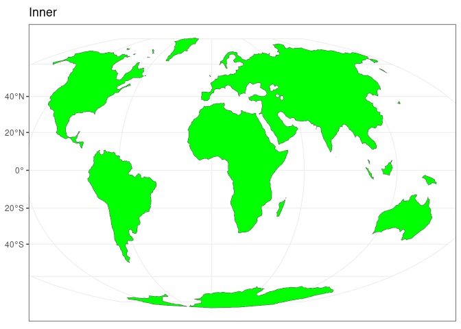

<!-- README.md is generated from README.Rmd. Please edit that file -->

# PupulationCoast

<!-- badges: start -->
<!-- badges: end -->

The goal of PupulationCoast is to generate shapefiles to calculate the
population density in coastal areas (100 km from the coast) and in the
inner areas of the coast

``` r
message("reading world")
World <- terra::vect(countriesHigh)
message("Creating new variable")
World$World <- "Yes"
message("Selecting only that new variable")
World <- World[,"World"]

message("Make valid")

World <- terra::makeValid(World)
message("Aggregating")
World <- terra::aggregate(World, by = "World", cores = 3)
message("Filling holes")
World <- terra::fillHoles(World) %>% 
  terra::project("+proj=moll")
message("Maxing valid again")
World <- terra::makeValid(World)
message("Selecting only that new variable")
World <- World[,"World"]
message("Making inner buffer")
World_Inner <- terra::buffer(World, width = -100000)

World_Inner <- terra::makeValid(World_Inner)

Coastal_World <- erase(World, World_Inner)
```

``` r
CoastalArea <- terra::expanse(Coastal_World, unit = "km") %>% sum()
InnerArea <- terra::expanse(World_Inner, unit = "km") %>% sum()
WorldArea <- terra::expanse(World, unit = "km") %>% sum()
```

``` r
ggplot() + geom_spatvector(data = World, fill = "green") + theme_bw() + ggtitle("World")
```

<!-- -->

The World area is 67,398,716 sq km

``` r
ggplot() + geom_spatvector(data = Coastal_World, fill = "green") + theme_bw() + ggtitle("Coastal")
```

<!-- -->

The Costal area is 21,134,419 sq km, that is 31.36 percent of the world

``` r
ggplot() + geom_spatvector(data = World_Inner, fill = "green") + theme_bw() + ggtitle("Inner")
```

<!-- -->

The Inner area is 114,840,316, that is 170.39 percent of the workd

``` r
terra::writeVector(World_Inner, "WorldInner.shp")
terra::writeVector(Coastal_World, "CoastalWorld.shp")
```
